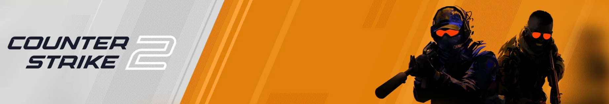

  <kbd></kbd>

# cs2configs
my personal config files for counter-strike 2

files have to be stored in: "...\Steam\steamapps\common\Counter-Strike Global Offensive\game\csgo\cfg" 

## Contents:

<ul>
  <li><a href="cfg/autoexec.cfg">autoexec.cfg</a></li>

  <li><a href="cfg/practice.cfg">practice.cfg</a></li>
  <li><a href="cfg/reset_cvars.cfg">reset_cvars.cfg</a></li>
  <li>
    <a href="cfg/bhop.cfg">bhop.cfg</a> /
    <a href="cfg/bhop_disable.cfg">bhop_disable.cfg</a>

  <li><a href="cfg/gamemodes">gamemodes</a></li>
  <li><a href="cfg/viewmodels">viewmodels</a></li>
  <li><a href="cfg/crosshairs">crosshairs</a></li>
  </li>
</ul>

## Description of files:

### autoexec.cfg :
My personal playing config including:
- Custom Viewmodel, Sensitivity & Crosshair
- Custom Keybinds

### practice.cfg :
Config for mostly testing and practicing stuff in private games including:
- Placeable static bots per keypress
- Noclip bind
- Infinite ammo, money, buytime & round-length
- Buying anywhere
- Grenade preview window

### bhop.cfg :
Simple config to enable auto-bunnyhopping in private games.
- Disable by using "bhop_disable.cfg"

### reset_cvars.cfg :
Resets all custom cvars and restores normal gameplay.

### gamemodes :
A collection of custom gamemodes.

### viewmodels & crosshairs :
Some viewmodels and crosshairs I use for playing.
- Switchable via arrow keys (set in autoexec.cfg)
