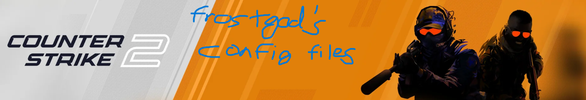

  <kbd></kbd>

# cs2configs
My personal config files for counter-strike 2
<ul>
<li> Config files have to be stored in: <code>"...\Steam\steamapps\common\Counter-Strike Global Offensive\game\csgo\cfg"</code></li>
<li> Video config has to be stored in: <code>"...\Steam\userdata\YOUR_STEAM32ID_HERE\730\local\cfg</code></li>
  <ul>
    <li> To find your STEAM32 ID, use a site like <a href="https://steamid.xyz/">steamid.xyz</a> , enter your Steam profile URL and copy the STEAM32 ID </li>
  </ul>
</ul>

## Contents:

<ul>
  <li> 📁cfg </li>
    <ul>
      <li><a href="cfg/autoexec.cfg">autoexec.cfg</a></li>
      <li><a href="cfg/practice.cfg">practice.cfg</a></li>
      <li><a href="cfg/reset_cvars.cfg">reset_cvars.cfg</a></li>
      <li>
        <a href="cfg/bhop.cfg">bhop.cfg</a> /
        <a href="cfg/bhop_disable.cfg">bhop_disable.cfg</a>
      <li> 📁crosshairs </li>
      <ul>
          <li><a href="cfg/crosshairs/crosshair_cross.cfg">crosshair_cross.cfg</a></li>
          <li><a href="cfg/crosshairs/crosshair_dot.cfg">crosshair_dot.cfg</a></li>
      </ul>
      <li> 📁gamemodes </li>
      <ul>
          <li><a href="cfg/gamemodes/flying_scoutsman.cfg">flying_scoutsman.cfg</a></li>
      </ul>
      <li> 📁viewmodels </li>
      <ul>
          <li><a href="cfg/viewmodels/viewmodel_close.cfg">viewmodel_close.cfg</a></li>
          <li><a href="cfg/viewmodels/viewmodel_normal.cfg">viewmodel_normal.cfg</a></li>
      </ul>
    </ul>
</ul>
<ul>  
  <li> 📁video </li>
    <ul>
        <li><a href="video/cs2_video.txt">cs2_video.txt</a></li>
    </ul>
</ul>

## Description of files:

### :star2: autoexec.cfg :
My personal playing config including:
- Custom Viewmodel, Sensitivity & Crosshair
- Custom Keybinds
##

### :star2: cs2_video.txt :
My video settings including:
- 4:3 Setup
- Graphic settings for maximum performance and vision clarity
##

### :star2: practice.cfg :
Mostly for testing and practicing stuff in private games including:
- Static bots 
- Infinite ammo, money, buytime & round-length
- Buying anywhere
- Grenade preview window
##

### :star2: bhop.cfg :
Simple config to enable auto-bunnyhopping in private games.
- Disable by using "bhop_disable.cfg"
##

### :star2: reset_cvars.cfg :
Resets all custom cvars and restores normal gameplay.
##

### :star2: gamemodes :
A collection of custom gamemodes.
##

### :star2: viewmodels & crosshairs :
Some viewmodels and crosshairs I use for playing.
- Switchable via arrow keys (set in autoexec.cfg)
##
